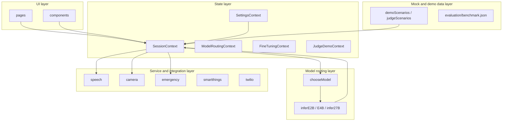

# Relay — architecture overview

Relay is a mobile-first PWA. This document maps the codebase to five logical layers.

## Layer diagram

## UI layer (`src/pages`, `src/components`)

- **Pages**: route-level shells (`PatientHomePage`, `CaregiverPage`, `SettingsPage`, `DemoPage`, `AboutPage`).
- **Primitives**: reusable glass-style controls (`Card`, `PillButton`, `Modal`, etc.).
- **Domain components**: `patient/`, `caregiver/`, `settings/`, `demo/`.

## State layer (`src/contexts`)

| Context | Responsibility |
|---------|------------------|
| `SessionContext` | Listening/processing flags, current interpretation, history, vision toggle, language/direction, optional judge-demo overlay fields |
| `ModelRoutingContext` | Current model id, append-only routing log (persisted) |
| `SettingsContext` | Accessibility, integrations, languages, demo mode, voice-banking wizard state |
| `FineTuningContext` | Mock personalization metrics (Unsloth narrative) |
| `JudgeDemoContext` | Orchestrates phased “Judge Demo” without coupling all pages to demo logic |

## Model routing layer (`src/services/modelRouter.ts`)

- **`chooseModel(req)`** — deterministic rules (stand-in for Cactus): multimodal / high-urgency → `27B`, symbols → `E4B`, else → `E2B`.
- **`runInference`** — dispatches to `inferE2B` / `inferE4B` / `infer27B` (currently mocked latency + `draftInterpretation`).

## Service / integration layer (`src/services`)

Typed boundaries for backends: speech I/O, camera context, Twilio emergency, SmartThings scenes, Twilio SMS test. Each file documents `TODO` for production wiring.

## Mock and demo data layer

- **`demoScenarios.ts` / `judgeScenarios.ts`** — scripted interpretations for judges.
- **`evaluation/benchmark.json`** — structured phrase-reconstruction examples for before/after evaluation.

## Persistence

- `localStorage` keys prefixed with `relay.*` (session history, settings, routing log, fine-tuning snapshot).

For Gemma-specific semantics and what is mocked vs real, see [GEMMA_AND_INTEGRATIONS.md](./GEMMA_AND_INTEGRATIONS.md).
