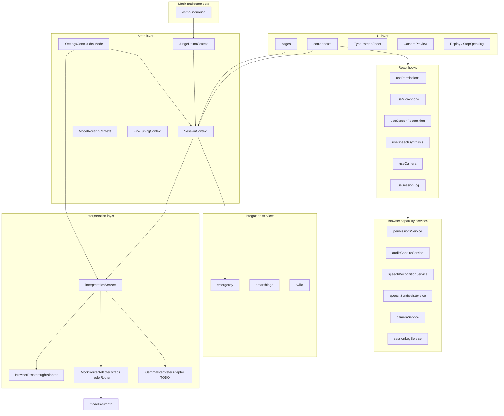

# Relay — architecture overview

Relay is a mobile-first PWA. This document maps the codebase to five logical layers.

## Layer diagram

## UI layer (`src/pages`, `src/components`)

- **Pages**: route-level shells (`PatientHomePage`, `CaregiverPage`, `SettingsPage`, `DemoPage`, `AboutPage`).
- **Primitives**: reusable glass-style controls (`Card`, `PillButton`, `Modal`, etc.).
- **Domain components**: `patient/`, `caregiver/`, `settings/`, `demo/`.
- New: `CameraPreview`, `TypeInsteadSheet`, `InterpreterModePicker`, `DeveloperPanel`.

## Hooks (`src/hooks`)

Typed wrappers around the browser capability services with lifecycle-safe cleanup:

| Hook | Wraps |
|------|---------------------|
| `usePermissions(kind)` | `permissionsService` |
| `useMicrophone` | `audioCaptureService` |
| `useSpeechRecognition` | `speechRecognitionService` |
| `useSpeechSynthesis` | `speechSynthesisService` |
| `useCamera` | `cameraService` |
| `useSessionLog` | `sessionLogService` |

All browser API access lives inside these services; UI consumes typed state only.

## State layer (`src/contexts`)

| Context | Responsibility |
|---------|------------------|
| `SessionContext` | Listening/processing flags, interim transcript, current interpretation, pending camera frame, history, vision toggle, language/direction |
| `ModelRoutingContext` | Current model id, append-only routing log (persisted) |
| `SettingsContext` | Accessibility, integrations, languages, demo mode, voice-banking wizard state, `devMode.interpreter` selector |
| `FineTuningContext` | Mock personalization metrics (Unsloth narrative) |
| `JudgeDemoContext` | Orchestrates phased "Judge Demo" without coupling all pages to demo logic |

## Interpretation layer (`src/services/interpretationService.ts`)

Single entry point for `raw input -> interpreted phrase`. The caller never picks the model directly; adapters are selected by `settings.devMode.interpreter`:

- **`BrowserPassthroughAdapter`** — trims, capitalizes, fragment-map opt-in. No AI. Works offline.
- **`MockRouterAdapter`** — wraps `modelRouter.chooseModel` + `runInference`; preserves routing log + ModelChip. Default for demo scenarios.
- **`GemmaInterpreterAdapter`** — placeholder; throws `NotImplemented`. Wire Ollama here to go live.

The returned `InterpretationResult` shape matches the future Gemma output (primaryText, alternates, confidence, urgency, detectedLanguage, mood, sourceModel, sourceType, routingReason, latencyMs, visionUsed).

## Browser capability services (`src/services/*Service.ts`)

| Service | Browser API |
|---------|---------|
| `permissionsService` | `navigator.permissions`, `getUserMedia` |
| `audioCaptureService` | `getUserMedia({ audio })`, `AnalyserNode` |
| `speechRecognitionService` | `SpeechRecognition` / `webkitSpeechRecognition` |
| `speechSynthesisService` | `window.speechSynthesis` |
| `cameraService` | `getUserMedia({ video })`, `<video>` + `<canvas>` for frame capture |
| `sessionLogService` | `localStorage` via `lib/storage` |

## Integration services (`src/services`)

Typed boundaries for back-end calls: Twilio emergency, SmartThings scenes, Twilio SMS test. Each file documents `TODO` for production wiring.

## Persistence

- `localStorage` keys prefixed with `relay.*` (session history, session events, settings, routing log, fine-tuning snapshot).

## Browser capability caveats

- **iOS Safari**: `SpeechRecognition` is partially supported on 14.5+; some versions return `not-allowed` unless served over HTTPS.
- **Firefox desktop**: `SpeechRecognition` not implemented — the Type-instead sheet is the primary input.
- **Android Chrome**: Most complete path; supports continuous STT, full TTS voice list.
- **All browsers**: `speechSynthesis.getVoices()` is async; the service resolves after `voiceschanged`.

## Working vs temporary fallback today

| Flow | Today | Plug-in point |
|------|----------------------|---------------|
| Mic permission + capture | Real `getUserMedia` + analyser level | — |
| Speech-to-text | Real Web Speech API where supported | `speechRecognitionService` |
| Typed-input fallback | `TypeInsteadSheet` → `submit({ sourceType: 'text' })` | — |
| Interpretation (default) | `BrowserPassthroughAdapter` (literal + light fragment map) | Swap `devMode.interpreter` |
| Interpretation (demo) | `MockRouterAdapter` → `chooseModel` / mocked `infer*` | Same path — swap body of `infer*` with Ollama fetch |
| Interpretation (Gemma) | `GemmaInterpreterAdapter` — `NotImplemented` | Fill in Ollama HTTP client |
| Text-to-speech | Real `speechSynthesis` | — |
| Camera preview + capture | Real `getUserMedia({ video })`; frame stored on session | Wire blob into `27B` multimodal path |
| Emergency escalation | In-app countdown + mocked Twilio service | Swap `services/twilio.ts` body |

For Gemma-specific semantics and what is mocked vs real, see [GEMMA_AND_INTEGRATIONS.md](./GEMMA_AND_INTEGRATIONS.md).
