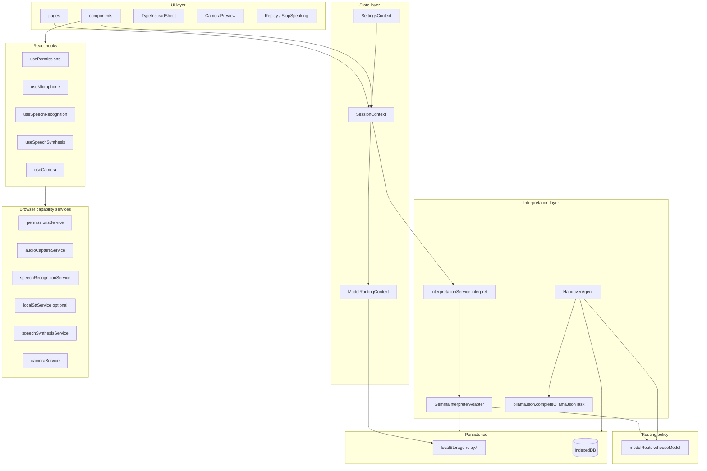

# Relay — architecture overview

Relay is a mobile-first PWA with a clean separation between:

1. **Real browser capability layer** — permissions, mic capture, STT, TTS, camera.
2. **Thin routing policy** — `chooseModel(req)` picks E2B / E4B / 27B.
3. **Single interpretation entry point** — `interpret(input)` delegated to one adapter.

There is no demo mode, no scripted scenarios, no fake answer dictionary. Model output is produced only by **`GemmaInterpreterAdapter`** calling **Ollama** when the configured base URL is reachable; otherwise the UI shows **`GemmaNotConnectedError`**.

For a **directory map** of `src/` (pages, components, contexts, services, hooks), see [SOURCE_LAYOUT.md](./SOURCE_LAYOUT.md).

## Layer diagram

## UI layer (`src/pages`, `src/components`)

- **Pages**: `PatientHomePage`, nested **Caregiver** routes under `src/pages/caregiver/` (`CaregiverLayout`, `CaregiverHubPage`, subpages), nested **Settings** routes under `src/pages/settings/` (`SettingsHubPage`, subpages), `AboutPage`, `OnboardingPage`.
- **Primitives**: reusable glass-style controls (`Card`, `PillButton`, `Modal`, etc.).
- **Domain components**: `patient/`, `caregiver/`, `settings/`, `onboarding/`, `dictionary/`.

Every input surface (mic + STT, `TypeInsteadSheet`, `SymbolBoardOverlay`, `CameraPreview` frame capture) funnels into `SessionContext.submit` → `interpret()`.

## Hooks (`src/hooks`)

Typed wrappers around the browser capability services with lifecycle-safe cleanup:

| Hook | Wraps |
|------|-------|
| `usePermissions(kind)` | `permissionsService` |
| `useMicrophone` | `audioCaptureService` |
| `useSpeechRecognition` | `speechRecognitionService` |
| `useSpeechSynthesis` | `speechSynthesisService` |
| `useCamera` | `cameraService` |
| `usePredictivePhrases` | `predictivePhrases` (Ollama JSON, optional) |
| `useOllamaStatus` / viewport / haptics / RTL | UX helpers |

All browser API access lives inside services; UI consumes typed state only.

## State layer (`src/contexts`)

| Context | Responsibility |
|---------|----------------|
| `SessionContext` | Listening/processing flags, interim transcript, current interpretation, pending camera frame, history (`relay.session.history`), vision toggle, language/direction, `lastError` for connectivity |
| `ModelRoutingContext` | Current model id, append-only routing log (`relay.routing.log`) |
| `SettingsContext` | Accessibility, language, Ollama URL + model tags, profile, `relayPowerOn` (`relay.settings`) |

## Interpretation layer

| Entry | File | Ollama API |
|-------|------|------------|
| Main interpret | `interpretationService.ts` → `GemmaInterpreterAdapter.ts` | `POST /api/generate` **streaming** |
| Handover | `HandoverAgent.ts` | `POST /api/generate` **non-streaming** JSON via `ollamaJson.ts` |
| Predictive / coach / insight | `predictivePhrases.ts`, `bilingualCoach.ts`, `sessionInsight.ts` | Same non-streaming helper |

`GemmaInterpreterAdapter` maps JSON into `InterpretationResult`: `primaryText`, `alternates`, `confidence`, `urgency`, `detectedLanguage`, bilingual fields, `sourceModel`, `routingReason`, `latencyMs`, `visionUsed`, `dictionaryMatchIds`, etc.

If Ollama is down or returns an error, `interpret` throws **`GemmaNotConnectedError`**; `SessionContext` sets `state.lastError` and the home flow shows a dismissible notice. No fabricated model text on failure.

## Routing policy (`src/services/modelRouter.ts`)

Pure, deterministic `chooseModel(req)`. No inference here — the adapter calls this before hitting Gemma. Kept as a stable interface so swapping to a learned router (e.g. Cactus) is a one-file change.

Also exports `logEntryFromInterpretation` used by `ModelRoutingContext` to populate the routing log once real results arrive. Handover tool timeline rows use `routingEntryFromToolEvent` in `HandoverAgent.ts`.

See [MODEL_ROUTING.md](./MODEL_ROUTING.md) for the decision table.

## Browser capability services (`src/services/*Service.ts`)

| Service | Browser API / network |
|---------|------------------------|
| `permissionsService` | `navigator.permissions`, `getUserMedia` error classification |
| `audioCaptureService` | `getUserMedia({ audio })`, `AnalyserNode` RMS level |
| `speechRecognitionService` | `SpeechRecognition` / `webkitSpeechRecognition` |
| `localSttService` | Optional `POST` to `VITE_RELAY_LOCAL_STT_URL` when Web Speech is empty/blocked |
| `speechSynthesisService` | `window.speechSynthesis` |
| `cameraService` | `getUserMedia({ video })`, `<video>` + `<canvas>` for frame capture |

## Persistence

### localStorage (`relay.*`)

| Key | Content |
|-----|---------|
| `relay.settings` | Full settings blob (Ollama base URL, languages, accessibility, profile metadata, voice sample **references**) |
| `relay.session.history` | Session interpretation history (also used for fine-tune export) |
| `relay.routing.log` | Append-only routing + handover tool audit lines |
| `relay.model.fast` / `relay.model.finetuned` / `relay.model.quality` | Optional per-tier Ollama tag overrides |

### IndexedDB

| Database | Store | Purpose |
|----------|-------|---------|
| `relay_patient_dictionary` | entries | Patient dictionary corpus |
| `relay_handover_notes` | notes | Structured shift handover notes |
| `relay-voice` | samples | Onboarding voice calibration audio blobs |

Voice sample **metadata** (transcript, duration, key) lives in `relay.settings`; blobs stay in `relay-voice` to avoid the ~5MB `localStorage` quota.

## Browser capability caveats

- **iOS Safari**: `SpeechRecognition` is partially supported on 14.5+; some versions return `not-allowed` unless served over HTTPS. Use local STT sidecar or type-instead.
- **Firefox desktop**: `SpeechRecognition` not implemented — the Type-instead sheet is the primary input.
- **Android Chrome**: Most complete path; supports continuous STT, full TTS voice list.
- **All browsers**: `speechSynthesis.getVoices()` is async; the service resolves after `voiceschanged`. Default voice choice ranks OS voices (e.g. Enhanced / Premium in the name); users can override in **Settings → Language**.

## Wired vs stub today

| Flow | Today | Plug-in point |
|------|-------|---------------|
| Mic permission + capture | Real `getUserMedia` + analyser level | — |
| Speech-to-text | Real Web Speech API where supported; optional local sidecar | `speechRecognitionService`, `localSttService` |
| Text-to-speech | Real `speechSynthesis` (ranked + optional `ttsVoiceUri` in settings) | — |
| Camera preview + frame capture | Real `getUserMedia({ video })`; frame stored on session | Fed into `interpret()` as `imageDataUrl` |
| Routing decision | Real `chooseModel` | Swap to Cactus if desired |
| Interpretation | **Ollama** via `GemmaInterpreterAdapter`; **error** if unreachable | `GemmaInterpreterAdapter.ts` |
| Handover | Client tools + one `/api/generate` | `HandoverAgent.ts` |
| Predictive phrases / coach / insight | Ollama JSON when reachable | respective `*.ts` in `interpretation/` |

For the Gemma wiring checklist, see [GEMMA_AND_INTEGRATIONS.md](./GEMMA_AND_INTEGRATIONS.md). For local setup and scripts, see [README.md](../README.md).
