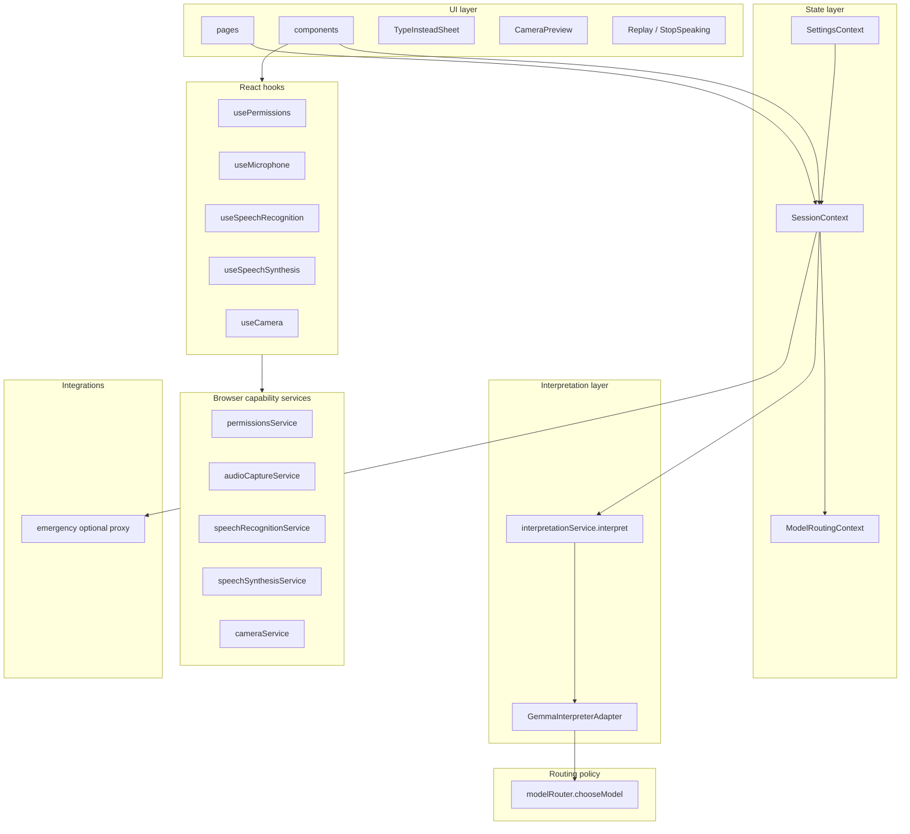

# Relay — architecture overview

Relay is a mobile-first PWA with a clean separation between:

1. **Real browser capability layer** — permissions, mic capture, STT, TTS, camera.
2. **Thin routing policy** — `chooseModel(req)` picks E2B / E4B / 27B.
3. **Single interpretation entry point** — `interpret(input)` delegated to one adapter.

There is no demo mode, no scripted scenarios, no fake answer dictionary. Model output is produced only by **`GemmaInterpreterAdapter`** calling **Ollama** when `http://localhost:11434` is reachable; otherwise the UI shows **`GemmaNotConnectedError`**.

For a **directory map** of `src/` (pages, components, contexts, services, hooks), see [SOURCE_LAYOUT.md](./SOURCE_LAYOUT.md).

## Layer diagram

## UI layer (`src/pages`, `src/components`)

- **Pages**: `PatientHomePage`, `CaregiverPage`, `SettingsPage`, `AboutPage`.
- **Primitives**: reusable glass-style controls (`Card`, `PillButton`, `Modal`, etc.).
- **Domain components**: `patient/`, `caregiver/`, `settings/`.

Every input surface (mic + STT, `TypeInsteadSheet`, `SymbolBoardOverlay`, `CameraPreview` frame capture) funnels into `SessionContext.submit` → `interpret()`.

## Hooks (`src/hooks`)

Typed wrappers around the browser capability services with lifecycle-safe cleanup:

| Hook | Wraps |
|------|-------|
| `usePermissions(kind)` | `permissionsService` |
| `useMicrophone` | `audioCaptureService` |
| `useSpeechRecognition` | `speechRecognitionService` |
| `useSpeechSynthesis` | `speechSynthesisService` |
| `useCamera` | `cameraService` |

All browser API access lives inside these services; UI consumes typed state only.

## State layer (`src/contexts`)

| Context | Responsibility |
|---------|----------------|
| `SessionContext` | Listening/processing flags, interim transcript, current interpretation, pending camera frame, history, vision toggle, language/direction, `lastError` surface for "not connected" states |
| `ModelRoutingContext` | Current model id, append-only routing log (persisted) |
| `SettingsContext` | Accessibility, integrations, language |

## Interpretation layer (`src/services/interpretationService.ts`)

Single entry point: `interpret(input)`. It calls **`GemmaInterpreterAdapter`**, which performs streaming **`POST /api/generate`** to local Ollama and maps JSON into `InterpretationResult`:
`primaryText`, `alternates`, `confidence`, `urgency`, `detectedLanguage`, `mood`, `sourceModel`, `sourceType`, `routingReason`, `latencyMs`, `visionUsed`, `sourceFragment`.

If Ollama is down or returns an error, `interpret` throws **`GemmaNotConnectedError`**; `SessionContext` sets `state.lastError` and `TranscriptionCard` shows a dismissible notice. No fabricated model text is injected on failure.

## Routing policy (`src/services/modelRouter.ts`)

Pure, deterministic `chooseModel(req)`. No inference here — the adapter calls this (or substitutes a learned router) before hitting Gemma. Kept as a stable interface so swapping to Cactus is a one-file change.

Also exports `logEntryFromInterpretation` used by `ModelRoutingContext` to populate the routing log once real results arrive.

## Browser capability services (`src/services/*Service.ts`)

| Service | Browser API |
|---------|-------------|
| `permissionsService` | `navigator.permissions`, `getUserMedia` error classification |
| `audioCaptureService` | `getUserMedia({ audio })`, `AnalyserNode` RMS level |
| `speechRecognitionService` | `SpeechRecognition` / `webkitSpeechRecognition` |
| `speechSynthesisService` | `window.speechSynthesis` |
| `cameraService` | `getUserMedia({ video })`, `<video>` + `<canvas>` for frame capture |

## Integrations (`src/services`)

- **`emergency.ts`** — When `relay.emergency.proxyUrl` (localStorage) and caregiver phone (settings) are set, posts JSON to your HTTPS proxy; otherwise throws `EmergencyNotConnectedError`.

## Persistence

- `localStorage` keys prefixed with `relay.*` (session history, settings, routing log).

## Browser capability caveats

- **iOS Safari**: `SpeechRecognition` is partially supported on 14.5+; some versions return `not-allowed` unless served over HTTPS.
- **Firefox desktop**: `SpeechRecognition` not implemented — the Type-instead sheet is the primary input.
- **Android Chrome**: Most complete path; supports continuous STT, full TTS voice list.
- **All browsers**: `speechSynthesis.getVoices()` is async; the service resolves after `voiceschanged`.

## Wired vs stub today

| Flow | Today | Plug-in point |
|------|-------|---------------|
| Mic permission + capture | Real `getUserMedia` + analyser level | — |
| Speech-to-text | Real Web Speech API where supported | `speechRecognitionService` |
| Text-to-speech | Real `speechSynthesis` | — |
| Camera preview + frame capture | Real `getUserMedia({ video })`; frame stored on session | Fed into `interpret()` as `imageDataUrl` |
| Routing decision | Real `chooseModel` | Swap to Cactus if desired |
| Interpretation | **Ollama** via `GemmaInterpreterAdapter`; **error** if unreachable | `GemmaInterpreterAdapter.ts` |
| Emergency escalation | In-app countdown + **POST to configured proxy** when set | `services/emergency.ts` |

For the Gemma wiring checklist, see [GEMMA_AND_INTEGRATIONS.md](./GEMMA_AND_INTEGRATIONS.md). For local setup and scripts, see [README.md](../README.md).
