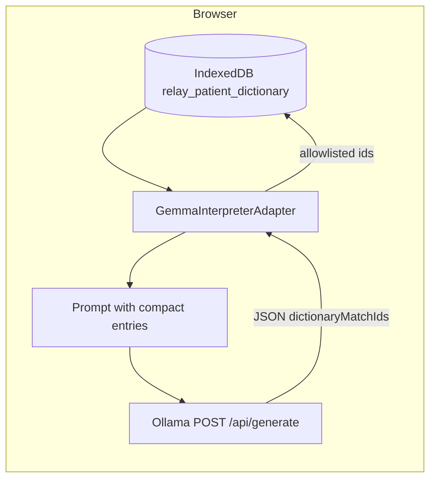

# Grounding: dictionary and handover tools

Relay keeps model outputs **grounded** in local, user-controlled data: the **patient dictionary** (IndexedDB) and, for caregiver handover, a **staged tool pipeline** that reads only what the browser already stores—then asks Gemma once to write the note.

## Patient dictionary (interpretation path)

1. **Load** — Before `POST /api/generate`, the adapter loads up to 30 relevant entries via [`patientDictionary`](../src/lib/patientDictionary.ts) (`listEntries` by modality / recency).
2. **Inject** — Compact JSON is appended to the prompt (“Patient's known signals”).
3. **Respond** — The model returns `dictionaryMatchIds` (intended dictionary row ids).
4. **Validate** — The adapter filters ids to those **allowed** (loaded into the prompt); stray ids are dropped.
5. **Reinforce** — For each allowed id, `incrementConfirmation` updates local confirmation counts.

Entry schema: [`src/types/dictionary.ts`](../src/types/dictionary.ts) (`DictionaryEntry`, schema `relay.patientDictionary.v1`).

If Ollama is unreachable, the user sees **`GemmaNotConnectedError`** — there is no fallback that fabricates model text.

## Handover agent (client tools + single generate)

The handover flow does **not** use Ollama remote tool calling on `/api/chat`. [`HandoverAgent.ts`](../src/services/interpretation/HandoverAgent.ts) runs:

| Step | Tool module | What it does |
|------|-------------|--------------|
| 1 | `getSessionHistory` | Recent interpretations in the shift window (from session context). |
| 2 | `getDictionaryDeltas` | Dictionary rows created/updated since shift start (IndexedDB). |
| 3 | `getAlertLog` | HIGH-urgency session events. |
| 4 | `getRoutingLog` | Model routing and handover audit lines. |
| 5 | `summarizePatterns` | Rule-based local pattern summary (**no** extra LLM). |
| 6 | *(model)* | One `completeOllamaJsonTask` → `POST /api/generate`, tier **27B**, `format: json`. |
| 7 | `writeHandoverNote` | Persist parsed `HandoverNote` to IndexedDB (`relay_handover_notes`, schema `relay.handoverNote.v2`). |

The caregiver UI still shows **tool-style timeline events** (`HandoverToolEvent`) via `onToolEvent`—each emit marks a local fetch or the final model write—so carers see what ran before the note appeared.

**Errors:**

- Ollama down → **`GemmaNotConnectedError`** (same as interpretation).
- Model omitted `summary` or returned unparseable JSON → **`HandoverToolCapabilityError`** with actionable copy.

Note fields (`summary`, `notableEvents`, `newSignalsLearned`, `patternsDetected`, `flagsForNextCarer`, `suggestedFollowUps`, `communicationNotes`, `accessibilityFlagsForNextCarer`, `residentPhrasedPriorities`): see [`src/types/handover.ts`](../src/types/handover.ts).

## JSONL export (optional grounding for training)

Carers can export confirmed dictionary rows and session history snippets as JSONL via [`fineTuneExport.ts`](../src/lib/fineTuneExport.ts) for offline fine-tuning workflows. This does not send data to any server automatically.

## Further reading

- [GEMMA_AND_INTEGRATIONS.md](./GEMMA_AND_INTEGRATIONS.md) — Ollama wire protocol, bilingual JSON, handover pipeline.
- [ARCHITECTURE.md](./ARCHITECTURE.md) — Layer diagram and browser limits.
- [MODEL_ROUTING.md](./MODEL_ROUTING.md) — Why handover uses the 27B tier (`inputType: 'compound'`).
