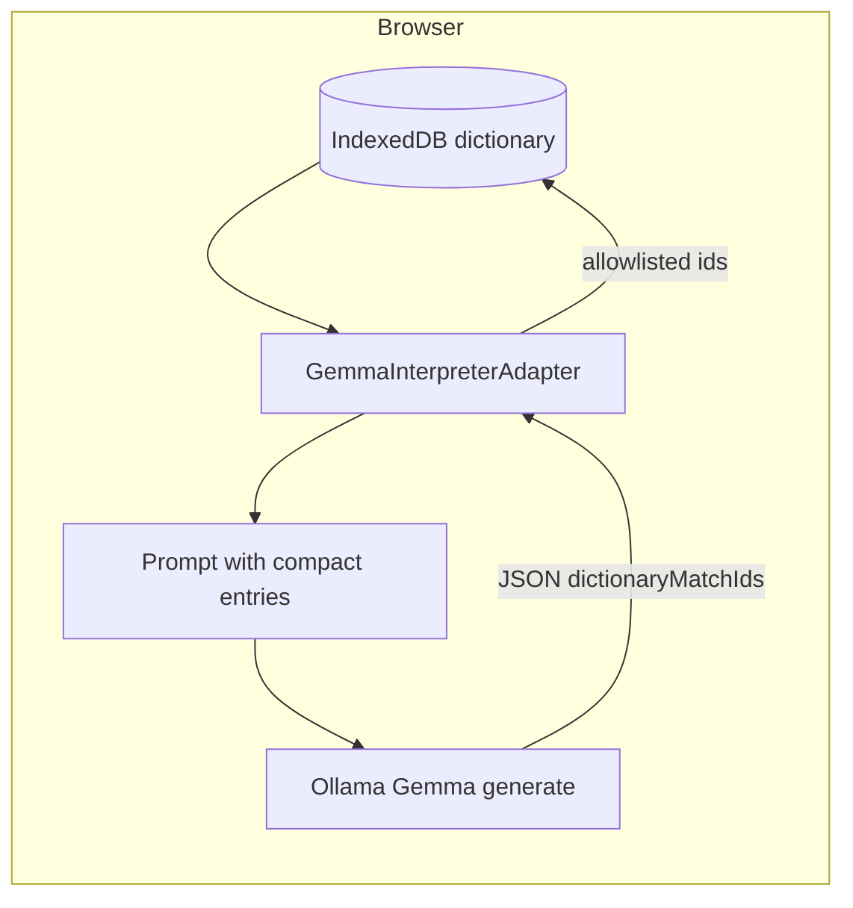

# Grounding: dictionary and handover tools

Relay keeps model outputs **grounded** in local, user-controlled data: the **patient dictionary** (IndexedDB) and, for caregiver handover, **Ollama tool calls** that only read or write what the browser already stores.

## Patient dictionary (interpretation path)

1. **Load** — Before `POST /api/generate`, the adapter loads up to 30 relevant entries via [`patientDictionary`](../src/lib/patientDictionary.ts) (`listEntries` by modality / recency).
2. **Inject** — Compact JSON is appended to the prompt (“Patient's known signals”).
3. **Respond** — The model returns `dictionaryMatchIds` (intended dictionary row ids).
4. **Validate** — The adapter filters ids to those **allowed** (loaded into the prompt); stray ids are dropped.
5. **Reinforce** — For each allowed id, `incrementConfirmation` updates local confirmation counts.

If Ollama is unreachable, the user sees **`GemmaNotConnectedError`** — there is no fallback that fabricates model text.

## Handover agent (tool path)

The handover flow uses Ollama **`/api/chat`** with a **real tool registry** ([`HandoverAgent.ts`](../src/services/interpretation/HandoverAgent.ts), [`tools/`](../src/services/interpretation/tools/)):

| Tool | Role |
|------|------|
| `get_session_history` | Read recent session lines from local storage. |
| `get_dictionary_deltas` | Read dictionary changes since shift start. |
| `get_alert_log` | Read HIGH-urgency events. |
| `get_routing_log` | Read routing / audit entries. |
| `summarize_patterns` | Rule-based local summary (no extra LLM). |
| `write_handover_note` | Persist structured note to IndexedDB. |

Unsupported tool models raise **`HandoverToolCapabilityError`** with explicit UI text.

## Further reading

- [GEMMA_AND_INTEGRATIONS.md](./GEMMA_AND_INTEGRATIONS.md) — Ollama wire protocol and bilingual JSON.
- [ARCHITECTURE.md](./ARCHITECTURE.md) — Layer diagram and browser limits.
