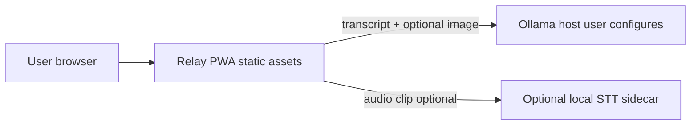

# Security notes

Relay is a **static client-side PWA**: there is no Relay-owned backend in this repository. Security posture is mostly **browser + user-chosen endpoints** (Ollama, optional local STT).

## Trust boundaries



| Destination | Data sent | Who controls it |
|-------------|-----------|-----------------|
| **Ollama** (`ollama.baseUrl` in settings) | Transcripts, prompts, optional camera base64, JSON task prompts | Operator of that URL (often same machine or LAN) |
| **Local STT** (`VITE_RELAY_LOCAL_STT_URL`) | Recorded audio for transcription | Operator of that HTTP service |
| **IndexedDB / localStorage** | Dictionary, handover notes, session history, voice samples | Same browser profile on device |

Relay does **not** intentionally call analytics, font CDNs, telemetry, avatars, or cloud LLMs in production builds.

## Secrets and configuration

- **No API keys** are embedded in the repo. Ollama base URL and model tag overrides live in **browser localStorage** via Settings (user-controlled).
- **Do not commit** personal `localStorage` dumps, voice samples, or `.env.local` with real endpoints into public forks.
- Copy [.env.example](../.env.example) to **`.env.local`** for dev-only `VITE_*` vars (e.g. local STT URL). Vite exposes only variables prefixed with `VITE_` to the client bundle.

### Environment variables (build-time)

| Variable | Scope | Purpose |
|----------|-------|---------|
| `VITE_RELAY_LOCAL_STT_URL` | Client bundle | Base URL for optional local STT sidecar (e.g. `http://127.0.0.1:9000`) |
| `RELAY_STT_CMD` | Sidecar process only | Shell command template for `scripts/local-stt-server.mjs` (`{input}`, `{language}`) |

Ollama URL is **not** a Vite env var—it is stored at runtime in `relay.settings` and read by `getResolvedOllamaBaseUrl()`.

### Sensitive localStorage keys

| Key | Contains |
|-----|----------|
| `relay.settings` | Profile, languages, Ollama URL, accessibility, voice sample metadata |
| `relay.session.history` | Interpretation history (may include health-related phrases) |
| `relay.routing.log` | Model tiers, reasons, tool audit lines |
| `relay.model.*` | Ollama image tag overrides |

Treat device backups and shared tablets as **in-scope** for data protection policies in care settings.

## Ollama hardening

- Use a host you trust; prefer **HTTPS** when the PWA is served over HTTPS (avoids mixed content blocks).
- On shared LANs, restrict Ollama to bind addresses/firewall rules so only ward devices can reach it.
- For cross-origin access, configure **CORS** on Ollama or a reverse proxy—see [GEMMA_AND_INTEGRATIONS.md](./GEMMA_AND_INTEGRATIONS.md#cors-https-and-mixed-content).
- Transcripts and images leave the browser for inference; they are **not** encrypted by Relay beyond transport TLS you configure.

## Content Security Policy (CSP)

For production hosting (nginx, Cloudflare, Vercel static, GitHub Pages behind a proxy), consider a **restrictive** CSP. Exact directives depend on your host (inline scripts, service worker). Starting point:

```
default-src 'self';
connect-src 'self' https://YOUR_OLLAMA_HOST http://127.0.0.1:11434 http://127.0.0.1:9000;
img-src 'self' data: blob:;
media-src 'self' blob:;
worker-src 'self';
font-src 'self';
```

- Add every **Ollama** and **STT** origin carers will use to `connect-src`.
- **Note:** Vite dev uses inline module scripts; dev CSP differs from production. Use hash or nonce `script-src` if you inline anything in production builds.

## PWA / service worker

Workbox precaches static assets. The service worker does not proxy Ollama traffic; inference `fetch` calls go directly from the page to the configured Ollama URL (subject to browser CORS/mixed-content rules).

## Dependency updates

Run `npm audit` periodically; pin major upgrades intentionally so the PWA stays reproducible for judges.

## Reporting

For security issues in this repository, open a private report to the maintainer per your org’s policy; do not file public issues with patient data or live Ollama URLs.
